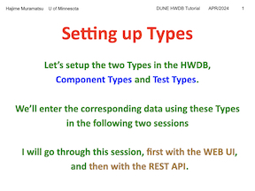

### Testing Image Embeds

Referencing fig directory as relative
~~~

~~~
{: .source}

#### Testing popup slide

Click on the image to open in window, right click to open in you window or tab.
~~~

~~~
{: .source}

### Testing Acordion

> #### Slide 1
>
>~~~
>>Click on the boxed downarrow to reveal the slide image.
>>
>>>{: .solution}
>>{: .challenge}
>~~~
>{: .source}
> Click on the boxed downarrow to reveal the slide image.
>> ## Slide Reveal
>>  
>>
>> Reference: Full Slide Show Link Here
>>{: output}
>{: .solution}
{: .challenge}

#### Blocked as alternative syntax highlighting

> #### Alternate Syntax Highlighting
>
>~~~
> 
>~~~
>{: .source}
> 
>
> 
>
{: .callout}


